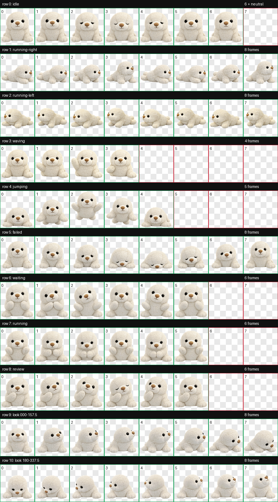

# Dean the Seal

Dean is a cuddly cream plush seal pet for Codex, with shiny black eyes, a tiny tan nose, and animated reactions for working, waiting, reviewing, celebrating, and more.

Dean is the baby seal of Coco and Leo. He was born on October 2, 2024.



## Install

Copy `pet.json` and `spritesheet.webp` into:

```text
~/.codex/pets/dean/
```

Restart or reload Codex if Dean does not appear immediately.

## Pet format

- Codex sprite format version 2
- 8 columns × 11 rows
- 192 × 208 pixels per cell
- 9 standard animation rows
- 16 clockwise look directions

The focused look-direction preview is available at [preview/look-directions.png](preview/look-directions.png).
